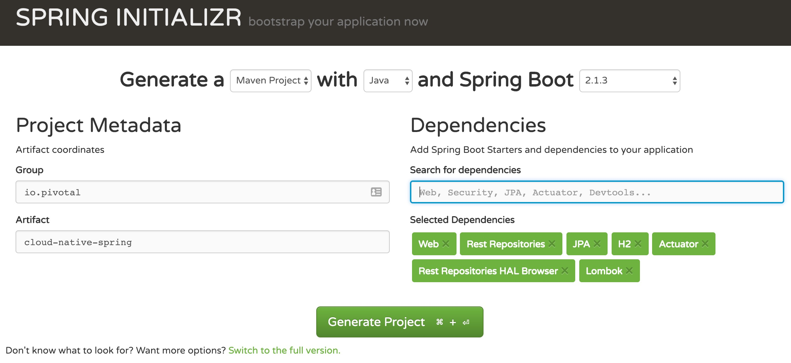

= Building a Spring Boot Application

== Create a Spring Boot Project

. Browse to https://start.spring.io

. Generate a Maven Project with Spring Boot 2.1.3.

. Fill out the *Project metadata* fields as follows:
+
Group:: +io.pivotal+
Artifact:: +cloud-native-spring+

. In the dependencies section, add the following manually:
+
*Web*, *Rest Repositories*, *JPA*, *H2*, *Actuator*, *Rest Repositories HAL Browser*, *Lombok*

. Click the _Generate Project_ button. Your browser will download a zip file.

. Copy then unpack the downloaded zip file to *Cloud-Native-Java-Workshop/labs/lab01/cloud-native-spring*
+
Your directory structure should now look like:
+
[source, bash]
---------------------------------------------------------------------
Cloud-Native-Java-Workshop:
├── labs
│   ├── lab01
│   │   ├── cloud-native-spring
---------------------------------------------------------------------

. Import the project’s pom.xml into your editor/IDE of choice.
+
*_STS Import Help:_*
+
Select File > Import… Then select Maven > Existing Maven Projects. On the Import Maven Projects page, browse to the /cloud-native-spring directory (e.g. Cloud-Native-Java-Workshop/labs/lab01/cloud-native-spring)

== Add an Endpoint

. Add an @RestController annotation to the class _io.pivotal.CloudNativeSpringApplication_ (/cloud-native-spring/src/main/java/io/pivotal/CloudNativeSpringApplication.java).
+
[source, java, numbered]
---------------------------------------------------------------------
package io.pivotal.cloudnativespring;

import org.springframework.boot.SpringApplication;
import org.springframework.boot.autoconfigure.SpringBootApplication;
import org.springframework.web.bind.annotation.RestController;

@SpringBootApplication
@RestController
public class CloudNativeSpringApplication {

    public static void main(String[] args) {
    	SpringApplication.run(CloudNativeSpringApplication.class, args);
    }

}
---------------------------------------------------------------------

. Add the following request handler to the class _io.pivotal.CloudNativeSpringApplication (/cloud-native-spring/src/main/java/io/pivotal/CloudNativeSpringApplication.java).
+
[source,java]
---------------------------------------------------------------------
@RequestMapping("/hello")
public String hello() {
    return "Hello World!";
}
---------------------------------------------------------------------
+
Completed:
+
[source,java]
---------------------------------------------------------------------
package io.pivotal.cloudnativespring;

import org.springframework.boot.SpringApplication;
import org.springframework.boot.autoconfigure.SpringBootApplication;
import org.springframework.web.bind.annotation.RequestMapping;
import org.springframework.web.bind.annotation.RestController;

@SpringBootApplication
@RestController
public class CloudNativeSpringApplication {

    public static void main(String[] args) {
        SpringApplication.run(CloudNativeSpringApplication.class, args);
    }

    @RequestMapping("/hello")
    public String hello() {
        return "Hello World!";
    }

}
---------------------------------------------------------------------

== Run the _cloud-native-spring_ Application

. In a terminal, change working directory to *Cloud-Native-Java-Workshop/labs/lab01/cloud-native-spring*
+
$ cd ~/Cloud-Native-Java-Workshop/labs/lab01/cloud-native-spring

. Run the application
+
$ mvn clean spring-boot:run

. You should see the application start up an embedded Apache Tomcat server on port 8080 (review terminal output):
+
[source,bash]
---------------------------------------------------------------------
2019-02-18 15:45:39.282  INFO 72558 --- [           main] o.s.b.w.embedded.tomcat.TomcatWebServer  : Tomcat started on port(s): 8080 (http) with context path ''
2019-02-18 15:45:39.285  INFO 72558 --- [           main] i.p.c.CloudNativeSpringApplication       : Started CloudNativeSpringApplication in 6.551 seconds (JVM running for 11.177)
---------------------------------------------------------------------

. Browse to http://localhost:8080/hello
+

. Stop the _cloud-native-spring_ application. In the terminal window: *Ctrl + C*

== Deploy _cloud-native-spring_ to Pivotal Cloud Foundry

. Build the application
+
[source,bash]
---------------------------------------------------------------------
$ mvn clean package
---------------------------------------------------------------------

. Create an application manifest in the root folder /cloud-native-spring
+
$ touch manifest.yml

. Add application metadata, using a text editor (of choice)
+
[source, bash]
---------------------------------------------------------------------
---
applications:
  - name: cloud-native-spring
    random-route: true
    memory: 1G
    instances: 1
    path: ./target/cloud-native-spring-0.0.1-SNAPSHOT.jar
    buildpack: java_buildpack_offline

---------------------------------------------------------------------

. Push application into Cloud Foundry
+
[source,bash]
---------------------------------------------------------------------
$ cf push
---------------------------------------------------------------------

. Find the URL created for your app in the health status report. Browse to your app.
[source,bash]
---------------------------------------------------------------------
$ cf app cloud-native-spring

Showing health and status for app cloud-native-spring in org Payments / space development as admin...

name:              cloud-native-spring
requested state:   started
routes:            cloud-native-spring-wacky-impala.apps.cnd-workshop.pcfdot.com
last uploaded:     Fri 22 Feb 09:18:03 CST 2019
stack:             cflinuxfs3
buildpacks:        java_buildpack_offline

type:           web
instances:      1/1
memory usage:   1024M
     state     since                  cpu    memory         disk           details
#0   running   2019-02-22T15:18:23Z   0.0%   205.8M of 1G   164.7M of 1G

---------------------------------------------------------------------

*Congratulations!* You’ve just completed your first Spring Boot application.
