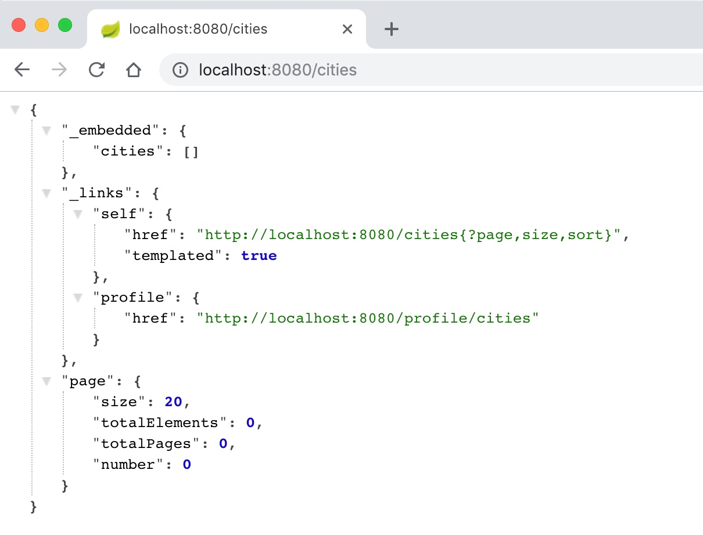
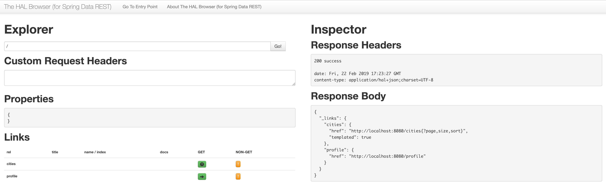

:compat-mode:
= Adding Persistence to Boot Application

In this lab we'll utilize Spring Boot, Spring Data, and Spring Data REST to create a fully-functional hypermedia-driven RESTful web service. We'll then deploy it to Pivotal Cloud Foundry.

== Create a Hypermedia-Driven RESTful Web Service with Spring Data REST (using JPA)

This application will create and expose a resource collection at "/cities" using Spring Data REST. We'll continue building upon the Spring Boot application we built in Lab 1.  The first stereotype we will need is the domain model itself, which is `City`.

== Add the domain object - City
. Create the package `io.pivotal.cloudnativespring.domain` and in that package create the class `City`. You can paste the following source code in that file, which represents Cities based on postal codes, global coordinates, etc:
+
[source, java, numbered]
---------------------------------------------------------------------
package io.pivotal.cloudnativespring.domain;

import lombok.Data;
import lombok.NoArgsConstructor;
import lombok.NonNull;

import javax.persistence.Entity;
import javax.persistence.GeneratedValue;
import javax.persistence.GenerationType;
import javax.persistence.Id;

@Entity
@Data
@NoArgsConstructor
public class City {

    @Id
    @GeneratedValue(strategy = GenerationType.IDENTITY)
    private long id;

    @NonNull
    private String name;

    @NonNull
    private String county;

    @NonNull
    private String stateCode;

    @NonNull
    private String postalCode;

    private String latitude;

    private String longitude;

}
---------------------------------------------------------------------
+
Notice that we're using Lombok annotations (@Data, @NoArgsConstructor, @NonNull) on the class, which reduces the need for a lot of boilerplate code in terms of Getters and Setters. You'll need to use your IDE's features to add the appropriate import statements.

. Create the package +io.pivotal.cloudnativespring.repositories+ and in that package create the interface +CityRepository+. Paste the following code and add appropriate imports:
+
[source,java]
---------------------------------------------------------------------
package io.pivotal.cloudnativespring.repositories;

import io.pivotal.cloudnativespring.domain.City;
import org.springframework.data.jpa.repository.JpaRepository;
import org.springframework.data.rest.core.annotation.RepositoryRestResource;

@RepositoryRestResource
public interface CityRepository extends JpaRepository<City, Long> {
}
---------------------------------------------------------------------
+
You’ll need to use your IDE’s features to add the appropriate import statements.

. You can remove the @RestController and the initial request handler from +io.pivotal.cloudnativespring.CloudNativeSpringApplication+ Spring Boot Application class to keep it simple.
+
[source,java]
---------------------------------------------------------------------
package io.pivotal.cloudnativespring;

import org.springframework.boot.SpringApplication;
import org.springframework.boot.autoconfigure.SpringBootApplication;

@SpringBootApplication
public class CloudNativeSpringApplication {

    public static void main(String[] args) {
        SpringApplication.run(CloudNativeSpringApplication.class, args);
    }

}
---------------------------------------------------------------------

== Run the _cloud-native-spring_ Application

. Run the application
+
[source,bash]
---------------------------------------------------------------------
$ mvn clean spring-boot:run
---------------------------------------------------------------------

. Access the application using +curl+ or your web browser using the newly added REST repository endpoint at http://localhost:8080/cities. You'll see that the primary endpoint automatically exposes the ability to page, size, and sort the response JSON.
+

+
[source,bash]
---------------------------------------------------------------------
$ curl -i http://localhost:8080/cities
HTTP/1.1 200
Content-Type: application/hal+json;charset=UTF-8
Transfer-Encoding: chunked
Date: Fri, 22 Feb 2019 17:17:17 GMT

{
  "_embedded" : {
    "cities" : [ ]
  },
  "_links" : {
    "self" : {
      "href" : "http://localhost:8080/cities{?page,size,sort}",
      "templated" : true
    },
    "profile" : {
      "href" : "http://localhost:8080/profile/cities"
    }
  },
  "page" : {
    "size" : 20,
    "totalElements" : 0,
    "totalPages" : 0,
    "number" : 0
  }
}
---------------------------------------------------------------------

So what have you done? Created three small classes and one build file, resulting in a fully-functional REST microservice. The application's +DataSource+ is created automatically by Spring Boot using the in-memory database because no other +DataSource+ was detected in the project.

Next we'll import some data.

== Importing Data

. Add this https://raw.githubusercontent.com/sharadg/Cloud-Native-Java-Workshop/master/labs/lab02/import.sql[import.sql file] found in *Cloud-Native-Java-Workshop/labs/lab02/* to +src/main/resources+. This is a rather large dataset containing all of the postal codes in the United States and its territories. This file will automatically be picked up by Hibernate and imported into the in-memory database.

. Restart the application.
+
[source,bash]
---------------------------------------------------------------------
$ mvn clean spring-boot:run
---------------------------------------------------------------------

. Access the application again. Notice the appropriate hypermedia is included for +next+, +previous+, and +self+. You can also select pages and page size by utilizing +?size=n&page=n+ on the URL string. Finally, you can sort the data utilizing +?sort=fieldName+ (replace fieldName with a cities attribute).
+
[source,bash]
---------------------------------------------------------------------
$ curl -i localhost:8080/cities
HTTP/1.1 200
Content-Type: application/hal+json;charset=UTF-8
Transfer-Encoding: chunked
Date: Fri, 22 Feb 2019 17:15:54 GMT

{
  "_embedded" : {
    "cities" : [ {
      "name" : "HOLTSVILLE",
      "county" : "SUFFOLK",
      "stateCode" : "NY",
      "postalCode" : "00501",
      "latitude" : "+40.922326",
      "longitude" : "-072.637078",
      "_links" : {
        "self" : {
          "href" : "http://localhost:8080/cities/1"
        },
        "city" : {
          "href" : "http://localhost:8080/cities/1"
        }
      }
// (omitted...)
    }, {
      "name" : "CASTANER",
      "county" : "LARES",
      "stateCode" : "PR",
      "postalCode" : "00631",
      "latitude" : "+18.269187",
      "longitude" : "-066.864993",
      "_links" : {
        "self" : {
          "href" : "http://localhost:8080/cities/20"
        },
        "city" : {
          "href" : "http://localhost:8080/cities/20"
        }
      }
    } ]
  },
  "_links" : {
    "first" : {
      "href" : "http://localhost:8080/cities?page=0&size=20"
    },
    "self" : {
      "href" : "http://localhost:8080/cities{?page,size,sort}",
      "templated" : true
    },
    "next" : {
      "href" : "http://localhost:8080/cities?page=1&size=20"
    },
    "last" : {
      "href" : "http://localhost:8080/cities?page=2137&size=20"
    },
    "profile" : {
      "href" : "http://localhost:8080/profile/cities"
    }
  },
  "page" : {
    "size" : 20,
    "totalElements" : 42741,
    "totalPages" : 2138,
    "number" : 0
  }
}
---------------------------------------------------------------------
+
. You can also use browser to navigate to http://localhost:8080 which brings up the HAL (http://stateless.co/hal_specification.html[Hypertext Application Language]) Browser (for Spring Data REST) that we got by including *Rest Repositories HAL Browser* as one of the POM starter dependencies in file: */cloud-native-spring/pom.xml*.  You should see the following dependency in the list:
+
[source, xml]
---------------------------------------------------------------------
<dependency>
	<groupId>org.springframework.data</groupId>
	<artifactId>spring-data-rest-hal-browser</artifactId>
</dependency>
---------------------------------------------------------------------

+

+
. Try the following URL Paths in your browser or +curl+ to see how the application behaves or through the HAL browser:
+
http://localhost:8080/cities?size=5
+
http://localhost:8080/cities?size=5&page=3
+
http://localhost:8080/cities?sort=postalCode,desc

Next we'll add searching capabilities.

== Adding Search

. Let's add some additional finder methods to +CityRepository+:
+
[source,java]
---------------------------------------------------------------------
@RestResource(path = "name", rel = "name")
Page<City> findByNameIgnoreCase(@Param("q") String name, Pageable pageable);

@RestResource(path = "nameContains", rel = "nameContains")
Page<City> findByNameContainsIgnoreCase(@Param("q") String name, Pageable pageable);

@RestResource(path = "stateCode", rel = "stateCode")
Page<City> findByStateCodeIgnoreCase(@Param("q") String stateCode, Pageable pageable);

@RestResource(path = "postalCode", rel = "postalCode")
Page<City> findByPostalCode(@Param("q") String postalCode, Pageable pageable);
---------------------------------------------------------------------

. Completed:
+
[source,java]
---------------------------------------------------------------------
package io.pivotal.cloudnativespring.repositories;

import io.pivotal.cloudnativespring.domain.City;
import org.springframework.data.domain.Page;
import org.springframework.data.domain.Pageable;
import org.springframework.data.jpa.repository.JpaRepository;
import org.springframework.data.repository.query.Param;
import org.springframework.data.rest.core.annotation.RepositoryRestResource;
import org.springframework.data.rest.core.annotation.RestResource;

@RepositoryRestResource
public interface CityRepository extends JpaRepository<City, Long> {

    @RestResource(path = "name", rel = "name")
    Page<City> findByNameIgnoreCase(@Param("q") String name, Pageable pageable);

    @RestResource(path = "nameContains", rel = "nameContains")
    Page<City> findByNameContainsIgnoreCase(@Param("q") String name, Pageable pageable);

    @RestResource(path = "stateCode", rel = "stateCode")
    Page<City> findByStateCodeIgnoreCase(@Param("q") String stateCode, Pageable pageable);

    @RestResource(path = "postalCode", rel = "postalCode")
    Page<City> findByPostalCode(@Param("q") String postalCode, Pageable pageable);
}
---------------------------------------------------------------------

. Run the application
+
[source,bash]
---------------------------------------------------------------------
$ mvn clean spring-boot:run
---------------------------------------------------------------------

. Access the application again. Notice that hypermedia for a new +search+ endpoint has appeared.
+
[source,bash]
---------------------------------------------------------------------
$ curl -i "localhost:8080/cities"
HTTP/1.1 200
Content-Type: application/hal+json;charset=UTF-8
Transfer-Encoding: chunked
Date: Fri, 22 Feb 2019 17:36:42 GMT

{
  "_embedded" : {
    "cities" : [ {
      "name" : "HOLTSVILLE",
      "county" : "SUFFOLK",
      "stateCode" : "NY",
      "postalCode" : "00501",
      "latitude" : "+40.922326",
      "longitude" : "-072.637078",
      "_links" : {
        "self" : {
          "href" : "http://localhost:8080/cities/1"
        },
        "city" : {
          "href" : "http://localhost:8080/cities/1"
        }
      }
// ... omitted
  "_links" : {
    "first" : {
      "href" : "http://localhost:8080/cities?page=0&size=20"
    },
    "self" : {
      "href" : "http://localhost:8080/cities{?page,size,sort}",
      "templated" : true
    },
    "next" : {
      "href" : "http://localhost:8080/cities?page=1&size=20"
    },
    "last" : {
      "href" : "http://localhost:8080/cities?page=2137&size=20"
    },
    "profile" : {
      "href" : "http://localhost:8080/profile/cities"
    },
    "search" : {
      "href" : "http://localhost:8080/cities/search"
    }
  },
  "page" : {
    "size" : 20,
    "totalElements" : 42741,
    "totalPages" : 2138,
    "number" : 0
  }
}
---------------------------------------------------------------------

. Access the new +search+ endpoint:
+
http://localhost:8080/cities/search
+
[source,bash]
---------------------------------------------------------------------
$ curl -i "localhost:8080/cities/search"
HTTP/1.1 200
Content-Type: application/hal+json;charset=UTF-8
Transfer-Encoding: chunked
Date: Fri, 22 Feb 2019 17:46:49 GMT

{
  "_links" : {
    "postalCode" : {
      "href" : "http://localhost:8080/cities/search/postalCode{?q,page,size,sort}",
      "templated" : true
    },
    "nameContains" : {
      "href" : "http://localhost:8080/cities/search/nameContains{?q,page,size,sort}",
      "templated" : true
    },
    "name" : {
      "href" : "http://localhost:8080/cities/search/name{?q,page,size,sort}",
      "templated" : true
    },
    "stateCode" : {
      "href" : "http://localhost:8080/cities/search/stateCode{?q,page,size,sort}",
      "templated" : true
    },
    "self" : {
      "href" : "http://localhost:8080/cities/search"
    }
  }
}
---------------------------------------------------------------------
+
Note that we now have new search endpoints for each of the finders that we added.

. Try a few of these endpoints. Feel free to substitute your own values for the parameters.
+
http://localhost:8080/cities/search/postalCode?q=75244
+
http://localhost:8080/cities/search/name?q=Boston
+
http://localhost:8080/cities/search/nameContains?q=Fort&size=1

== Pushing to Cloud Foundry

. Build the application
+
[source,bash]
---------------------------------------------------------------------
$ mvn clean package
---------------------------------------------------------------------

. You should already have an application manifest, +manifest.yml+, created in lab 1; this can be reused.  You'll want to add a timeout param so that our service has enough time to initialize with its data loading:
+
[source,yml]
---------------------------------------------------------------------
---
applications:
  - name: cloud-native-spring
    random-route: true
    memory: 1G
    instances: 1
    timeout: 180 # to give time for the data to import
    path: ./target/cloud-native-spring-0.0.1-SNAPSHOT.jar
    buildpack: java_buildpack_offline
---------------------------------------------------------------------

. Push to Cloud Foundry:
+
[source,bash]
---------------------------------------------------------------------
$ cf push

...

$ cf app cloud-native-spring

Showing health and status for app cloud-native-spring in org Payments / space development as admin...

name:              cloud-native-spring
requested state:   started
routes:            cloud-native-spring-wacky-impala.apps.cnd-workshop.pcfdot.com
last uploaded:     Fri 22 Feb 11:51:46 CST 2019
stack:             cflinuxfs3
buildpacks:        java_buildpack_offline

type:           web
instances:      1/1
memory usage:   1024M
     state     since                  cpu    memory         disk           details
#0   running   2019-02-22T17:52:11Z   0.4%   249.8M of 1G   170.8M of 1G

---------------------------------------------------------------------

. Access the application at the random route provided by CF:
+
[source,bash]
---------------------------------------------------------------------
$ curl -i cloud-native-spring-reliable-mouse.cfapps.io/cities
---------------------------------------------------------------------
