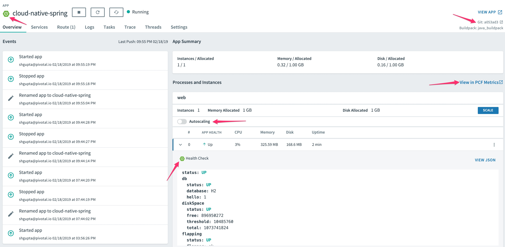
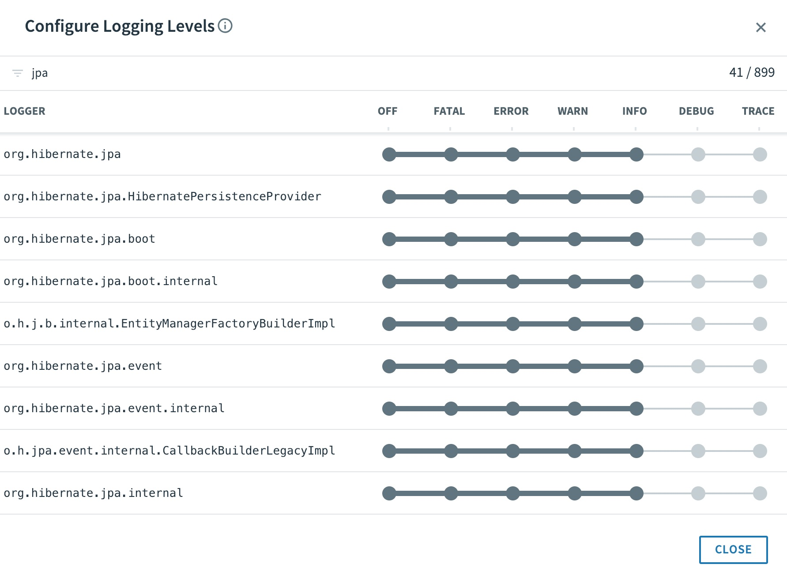

= Enhancing Boot Application with Metrics

== Set up the Actuator

Spring Boot includes a number of additional features to help you monitor and manage your application when it’s pushed to production. These features are added by adding _spring-boot-starter-actuator_ to the classpath.  During our initial project setup with *start.spring.io* we've already included that.

. Verify the Spring Boot Actuator dependency the following file: */cloud-native-spring/pom.xml*.  You should see the following dependency in the list:
+
[source, xml]
---------------------------------------------------------------------
<dependency>
	<groupId>org.springframework.boot</groupId>
	<artifactId>spring-boot-starter-actuator</artifactId>
</dependency>
---------------------------------------------------------------------

. By default, Spring Boot will only expose "health" and "info" endpoints (which is a good thing!). As part of our demo app, we will choose to expose all available actuator endpoints.  . Add the following properties to *cloud-native-spring/src/main/resources/application.properties*. You may have to create the file first.
+
[source, properties]
---------------------------------------------------------------------
management.endpoints.web.exposure.include=* # add this section
---------------------------------------------------------------------

. Run the updated application
+
[source,bash]
---------------------------------------------------------------------
$ mvn clean spring-boot:run
---------------------------------------------------------------------
+
Try out the following endpoints. The output is omitted here because it can be quite large:
+
http://localhost:8080/actuator/health
+
Displays Application and Datasource health information.  This can be customized based on application functionality, which we'll do later.
+
http://localhost:8080/actuator/beans
+
Displays a complete list of all the Spring beans in your application.
+
http://localhost:8080/actuator/httptrace
+
Displays HTTP trace information (by default, the last 100 HTTP request-response exchanges).
+
http://localhost:8080/actuator/configprops
+
Displays a collated list of all @ConfigurationProperties.
+
http://localhost:8080/actuator/env
+
Exposes properties from Spring’s ConfigurableEnvironment.
+
http://localhost:8080/actuator/mappings
+
Displays all URI request mappings and the controller methods to which they are mapped.
+
http://localhost:8080/actuator/threaddump
+
Performs a thread dump.
+
http://localhost:8080/actuator/conditions
+
Shows the conditions that were evaluated on configuration and auto-configuration classes and the reasons why they did or did not match.
+
More details on actuator endpoints https://docs.spring.io/spring-boot/docs/current/reference/html/production-ready-endpoints.html[here]

. Stop the cloud-native-spring application.

== Include Version Control Info

Spring Boot provides an endpoint (http://localhost:8080/actuator/info) that allows the exposure of arbitrary metadata. By default, it is empty.

One thing that _actuator_ does well is expose information about the specific build and version control coordinates for a given deployment.

. Edit the following file: */cloud-native-spring/pom.xml*. Add the _git-commit-id-plugin_ to your Maven build. You must edit the file and add the plugin code below into the existing _<plugins>_ XML structure, which should already have one plugin defined. The _git-commit-id-plugin_ adds Git branch and commit coordinates to the */info* endpoint:
+
[source, xml]
---------------------------------------------------------------------
<plugin>
	<groupId>pl.project13.maven</groupId>
	<artifactId>git-commit-id-plugin</artifactId>
	<configuration>
		<dotGitDirectory>../../../.git</dotGitDirectory>
	</configuration>
</plugin>
---------------------------------------------------------------------
+
*NOTE* The path *../../../.git* refers to the .git directory at the root of the lab materials repo.
+

. Completed:
+
[source, xml]
---------------------------------------------------------------------
<?xml version="1.0" encoding="UTF-8"?>
<project xmlns="http://maven.apache.org/POM/4.0.0" xmlns:xsi="http://www.w3.org/2001/XMLSchema-instance"
         xsi:schemaLocation="http://maven.apache.org/POM/4.0.0 http://maven.apache.org/xsd/maven-4.0.0.xsd">
    <modelVersion>4.0.0</modelVersion>
    <parent>
        <groupId>org.springframework.boot</groupId>
        <artifactId>spring-boot-starter-parent</artifactId>
        <version>2.1.3.RELEASE</version>
        <relativePath/> <!-- lookup parent from repository -->
    </parent>
    <groupId>io.pivotal</groupId>
    <artifactId>cloud-native-spring</artifactId>
    <version>0.0.1-SNAPSHOT</version>
    <name>cloud-native-spring</name>
    <description>Demo project for Spring Boot</description>

    <properties>
        <java.version>1.8</java.version>
    </properties>

    <dependencies>
        <dependency>
            <groupId>org.springframework.boot</groupId>
            <artifactId>spring-boot-starter-actuator</artifactId>
        </dependency>
        <dependency>
            <groupId>org.springframework.boot</groupId>
            <artifactId>spring-boot-starter-data-jpa</artifactId>
        </dependency>
        <dependency>
            <groupId>org.springframework.boot</groupId>
            <artifactId>spring-boot-starter-data-rest</artifactId>
        </dependency>
        <dependency>
            <groupId>org.springframework.boot</groupId>
            <artifactId>spring-boot-starter-web</artifactId>
        </dependency>
        <dependency>
            <groupId>org.springframework.data</groupId>
            <artifactId>spring-data-rest-hal-browser</artifactId>
        </dependency>

        <dependency>
            <groupId>com.h2database</groupId>
            <artifactId>h2</artifactId>
            <scope>runtime</scope>
        </dependency>
        <dependency>
            <groupId>org.projectlombok</groupId>
            <artifactId>lombok</artifactId>
            <optional>true</optional>
        </dependency>
        <dependency>
            <groupId>org.springframework.boot</groupId>
            <artifactId>spring-boot-starter-test</artifactId>
            <scope>test</scope>
        </dependency>
    </dependencies>

    <build>
        <plugins>
            <plugin>
                <groupId>org.springframework.boot</groupId>
                <artifactId>spring-boot-maven-plugin</artifactId>
            </plugin>
            <plugin>
                <groupId>pl.project13.maven</groupId>
                <artifactId>git-commit-id-plugin</artifactId>
                <configuration>
                    <dotGitDirectory>../../../.git</dotGitDirectory>
                </configuration>
            </plugin>
        </plugins>
    </build>

</project>
---------------------------------------------------------------------

. Run the _cloud-native-spring_ application:
+
$ mvn clean spring-boot:run

. Browse to http://localhost:8080/actuator/info. Git commit information is now included
+
[source,json]
---------------------------------------------------------------------
{
  "git": {
    "commit": {
      "time": "2019-02-22T17:55:02Z",
      "id": "edcced7"
    },
    "branch": "master"
  }
}
---------------------------------------------------------------------

. Stop the _cloud-native-spring_ application
+
*What Just Happened?*
+
By including the _git-commit-id-plugin_, details about git commit information will be included in the */actuator/info* endpoint. Git information is captured in a _git.properties_ file that is generated with the build. Review the following file: */cloud-native-spring/target/classes/git.properties*

== Include Build Info

. Add the following properties to *cloud-native-spring/src/main/resources/application.properties*. You may have to create the file first.
+
[source, properties]
---------------------------------------------------------------------
management.info.git.mode=full # add this section
---------------------------------------------------------------------
+
This will expose full git info on the /actuator/info endpoint.

. Build and run the cloud-native-spring application:
+
[source,bash]
---------------------------------------------------------------------
$ mvn clean spring-boot:run
---------------------------------------------------------------------

. Browse to http://localhost:8080/actuator/info. Build information is now included.
+
[source,json]
---------------------------------------------------------------------
{
  "git": {
    "build": {
      "host": "Sharads-MacBook-Pro.local",
      "version": "0.0.1-SNAPSHOT",
      "time": "2019-02-22T18:14:57Z",
      "user": {
        "name": "sharadg",
        "email": "91043+sharadg@users.noreply.github.com"
      }
    },
    "branch": "master",
    "commit": {
      "message": {
        "short": "Updated content for Lab02",
        "full": "Updated content for Lab02"
      },
      "id": {
        "describe": "edcced7-dirty",
        "abbrev": "edcced7",
        "describe-short": "edcced7-dirty",
        "full": "edcced703bddf4832e371496afbfd0af7827c2f8"
      },
      "time": "2019-02-22T17:55:02Z",
      "user": {
        "email": "91043+sharadg@users.noreply.github.com",
        "name": "sharadg"
      }
    },
    "closest": {
      "tag": {
        "name": "",
        "commit": {
          "count": ""
        }
      }
    },
    "dirty": "true",
    "remote": {
      "origin": {
        "url": "https://github.com/sharadg/Cloud-Native-Java-Workshop"
      }
    },
    "tags": "",
    "total": {
      "commit": {
        "count": "173"
      }
    }
  }
}
---------------------------------------------------------------------

. Stop the cloud-native-spring application.
+
*What Just Happened?*
+
We have mapped git commit properties from the pom.xml into the /actuator/info endpoint.
+
Read more about exposing data in the /actuator/info endpoint http://docs.spring.io/spring-boot/docs/current/reference/htmlsingle/#production-ready[here]

== Health Indicators

Spring Boot provides an endpoint http://localhost:8080/actuator/health that exposes various health indicators that describe the health of the given application.

Normally, when Spring Security is not enabled, the /actuator/health endpoint will only expose an UP or DOWN value.

[source,json]
---------------------------------------------------------------------
{
  "status": "UP"
}
---------------------------------------------------------------------

. To simplify working with the endpoint for this lab, we will turn off additional security for the health endpoint. Add the following to */cloud-native-spring/src/main/resources/application.properties*:
+
[source, properties]
---------------------------------------------------------------------
management.endpoint.health.show-details=always
---------------------------------------------------------------------

. Build and run the cloud-native-spring application:
+
[source,bash]
---------------------------------------------------------------------
$ mvn clean spring-boot:run
---------------------------------------------------------------------

. Browse to http://localhost:8080/actuator/health. Out of the box is a _DiskSpaceHealthIndicator_ that monitors health in terms of available disk space.
+
Would your Ops team like to know if the app is close to running out of disk space? DiskSpaceHealthIndicator can be customized via _DiskSpaceHealthIndicatorProperties_.
+
[source,json]
---------------------------------------------------------------------
{
  "status": "UP",
  "details": {
    "db": {
      "status": "UP",
      "details": {
        "database": "H2",
        "hello": 1
      }
    },
    "diskSpace": {
      "status": "UP",
      "details": {
        "total": 499963170816,
        "free": 87024320512,
        "threshold": 10485760
      }
    }
  }
}
---------------------------------------------------------------------

. Stop the cloud-native-spring application.

. Create the class _io.pivotal.cloudnativespring.FlappingHealthIndicator_ (/cloud-native-spring/src/main/java/io/pivotal/cloudnativespring/FlappingHealthIndicator.java) and into it paste the following code:
+
[source,java]
---------------------------------------------------------------------
package io.pivotal.cloudnativespring;

import org.springframework.boot.actuate.health.Health;
import org.springframework.boot.actuate.health.HealthIndicator;
import org.springframework.stereotype.Component;

import java.util.Random;

@Component
public class FlappingHealthIndicator implements HealthIndicator {
    private Random random = new Random(System.currentTimeMillis());

    @Override
    public Health health() {
        int result = random.nextInt(100);
        if(result < 50) {
            return Health.down()
                         .withDetail("flapper", "failure")
                         .withDetail("random", result)
                         .build();
        } else {
            return Health.up()
                         .withDetail("flapper", "ok")
                         .withDetail("random", result)
                         .build();
        }
    }
}
---------------------------------------------------------------------
+
This demo health indicator will randomize the health check.

. Build and run the _cloud-native-spring_ application:
+
[source,bash]
---------------------------------------------------------------------
$ mvn clean spring-boot:run
---------------------------------------------------------------------

. Browse to http://localhost:8080/actuator/health and verify that the output is similar to the following (and changes randomly!).
+
[source,json]
---------------------------------------------------------------------
{
  "status": "UP",
  "details": {
    "flapping": {
      "status": "UP",
      "details": {
        "flapper": "ok",
        "random": 76
      }
    },
    "db": {
      "status": "UP",
      "details": {
        "database": "H2",
        "hello": 1
      }
    },
    "diskSpace": {
      "status": "UP",
      "details": {
        "total": 499963170816,
        "free": 86771916800,
        "threshold": 10485760
      }
    }
  }
}
---------------------------------------------------------------------

+
[source,json]
---------------------------------------------------------------------
{
  "status": "DOWN",
  "details": {
    "flapping": {
      "status": "DOWN",
      "details": {
        "flapper": "failure",
        "random": 25
      }
    },
    "db": {
      "status": "UP",
      "details": {
        "database": "H2",
        "hello": 1
      }
    },
    "diskSpace": {
      "status": "UP",
      "details": {
        "total": 499963170816,
        "free": 86769766400,
        "threshold": 10485760
      }
    }
  }
}
---------------------------------------------------------------------

== Metrics

Spring Boot provides an endpoint http://localhost:8080/actuator/metrics that exposes several automatically collected metrics for your application. It also allows for the creation of custom metrics.

. Browse to http://localhost:8080/actuator/metrics. Review the metrics exposed.
+
[source,json]
---------------------------------------------------------------------
{
  "names": [
    "jvm.memory.max",
    "jvm.threads.states",
    "jdbc.connections.active",
    "process.files.max",
    "jvm.gc.memory.promoted",
    "http.server.requests",
    "system.load.average.1m",
    "jvm.memory.used",
    "jvm.gc.max.data.size",
    "jdbc.connections.max",
    "jdbc.connections.min",
    "jvm.memory.committed",
    "system.cpu.count",
    "logback.events",
    "tomcat.global.sent",
    "jvm.buffer.memory.used",
    "tomcat.sessions.created",
    "jvm.threads.daemon",
    "system.cpu.usage",
    "jvm.gc.memory.allocated",
    "tomcat.global.request.max",
    "hikaricp.connections.idle",
    "hikaricp.connections.pending",
    "tomcat.global.request",
    "tomcat.sessions.expired",
    "hikaricp.connections",
    "jvm.threads.live",
    "jvm.threads.peak",
    "tomcat.global.received",
    "hikaricp.connections.active",
    "hikaricp.connections.creation",
    "process.uptime",
    "tomcat.sessions.rejected",
    "process.cpu.usage",
    "tomcat.threads.config.max",
    "jvm.classes.loaded",
    "hikaricp.connections.max",
    "hikaricp.connections.min",
    "jvm.gc.pause",
    "jvm.classes.unloaded",
    "tomcat.global.error",
    "tomcat.sessions.active.current",
    "tomcat.sessions.alive.max",
    "jvm.gc.live.data.size",
    "hikaricp.connections.usage",
    "tomcat.threads.current",
    "hikaricp.connections.timeout",
    "process.files.open",
    "jvm.buffer.count",
    "jvm.buffer.total.capacity",
    "tomcat.sessions.active.max",
    "hikaricp.connections.acquire",
    "tomcat.threads.busy",
    "process.start.time"
  ]
}
---------------------------------------------------------------------
+

. Select one of the metrics from this list and append to /actuator/metrics, such as http://localhost:8080/actuator/metrics/http.server.requests. Review the metric details.
+
[source,json]
---------------------------------------------------------------------
{
  "name": "http.server.requests",
  "description": null,
  "baseUnit": "seconds",
  "measurements": [
    {
      "statistic": "COUNT",
      "value": 13
    },
    {
      "statistic": "TOTAL_TIME",
      "value": 0.6496210789999999
    },
    {
      "statistic": "MAX",
      "value": 0.357688147
    }
  ],
  "availableTags": [
    {
      "tag": "exception",
      "values": [
        "None"
      ]
    },
    {
      "tag": "method",
      "values": [
        "GET"
      ]
    },
    {
      "tag": "uri",
      "values": [
        "/actuator/metrics/{requiredMetricName}",
        "/actuator/health",
        "/cities",
        "/**/favicon.ico",
        "/actuator/metrics",
        "/**"
      ]
    },
    {
      "tag": "outcome",
      "values": [
        "CLIENT_ERROR",
        "SERVER_ERROR",
        "SUCCESS"
      ]
    },
    {
      "tag": "status",
      "values": [
        "503",
        "404",
        "200"
      ]
    }
  ]
}
---------------------------------------------------------------------

. Further, these are multi-dimensional metrics so you can further drill down into them by appending +?tag=key:value+ at the end of the metric, such as /actuator/metrics/http.server.requests?tag=status:200, such as http://localhost:8080/actuator/metrics/http.server.requests?tag=status:200. Review the metric details.
+
[source,json]
---------------------------------------------------------------------
{
  "name": "http.server.requests",
  "description": null,
  "baseUnit": "seconds",
  "measurements": [
    {
      "statistic": "COUNT",
      "value": 16
    },
    {
      "statistic": "TOTAL_TIME",
      "value": 0.637164562
    },
    {
      "statistic": "MAX",
      "value": 0.004182702
    }
  ],
  "availableTags": [
    {
      "tag": "exception",
      "values": [
        "None"
      ]
    },
    {
      "tag": "method",
      "values": [
        "GET"
      ]
    },
    {
      "tag": "uri",
      "values": [
        "/actuator/metrics/{requiredMetricName}",
        "/actuator/health",
        "/cities",
        "/**/favicon.ico",
        "/actuator/metrics"
      ]
    },
    {
      "tag": "outcome",
      "values": [
        "SUCCESS"
      ]
    }
  ]
}
---------------------------------------------------------------------

. Stop the cloud-native-spring application.

== Deploy _cloud-native-spring_ to Pivotal Cloud Foundry
. In order to add full build information to your artifact that is pushed to cloudfoundry, update */cloud-native-spring/pom.xml* and add the following execution and classifier to the spring-boot-maven-plugin:
+
[source, xml]
---------------------------------------------------------------------
<executions>
    <execution>
        <goals>
            <goal>build-info</goal>
        </goals>
    </execution>
</executions>
<configuration>
    <classifier>exec</classifier>
</configuration>
---------------------------------------------------------------------
+
The full plugin config should look like the following:
+
[source, xml]
---------------------------------------------------------------------
<plugin>
    <groupId>org.springframework.boot</groupId>
    <artifactId>spring-boot-maven-plugin</artifactId>
    <executions>
        <execution>
            <goals>
                <goal>build-info</goal>
            </goals>
        </execution>
    </executions>
    <configuration>
        <classifier>exec</classifier>
    </configuration>
</plugin>
---------------------------------------------------------------------

. Add the following properties to *cloud-native-spring/src/main/resources/application.properties*.
+
[source, properties]
---------------------------------------------------------------------
management.cloudfoundry.skip-ssl-validation=true
---------------------------------------------------------------------
+
Completed:
+
[source, properties]
---------------------------------------------------------------------
management.endpoints.web.exposure.include=*
management.info.git.mode=full
management.endpoint.health.show-details=always
management.cloudfoundry.skip-ssl-validation=true
---------------------------------------------------------------------

. Build the application
+
[source,bash]
---------------------------------------------------------------------
$ mvn clean package
---------------------------------------------------------------------

. By specifying a classifier we actually just produced 2 jars, one that is executable and one that can be used as an artifact that could be included in other apps (such as our Client UI app we'll create later).  Because of this we need to chance the name of the jar we included in our manifest.yml file.  Change the jar in the path property to *./target/cloud-native-spring-0.0.1-SNAPSHOT-exec.jar*:
+
[source, yaml]
---------------------------------------------------------------------
---
applications:
  - name: cloud-native-spring
    random-route: true
    memory: 1G
    instances: 1
    timeout: 180 # to give time for the data to import
    path: ./target/cloud-native-spring-0.0.1-SNAPSHOT-exec.jar
    buildpack: java_buildpack_offline
---------------------------------------------------------------------

. Push application into Cloud Foundry
+
$ cf push

. Find the URL created for your app in the health status report. Browse to your app.  Also view your application details in the Apps Mananger UI:
+

. From this UI you can also dynamically change logging levels:
+

*Congratulations!* You’ve just learned how to add health data and metrics to any Spring Boot application.
