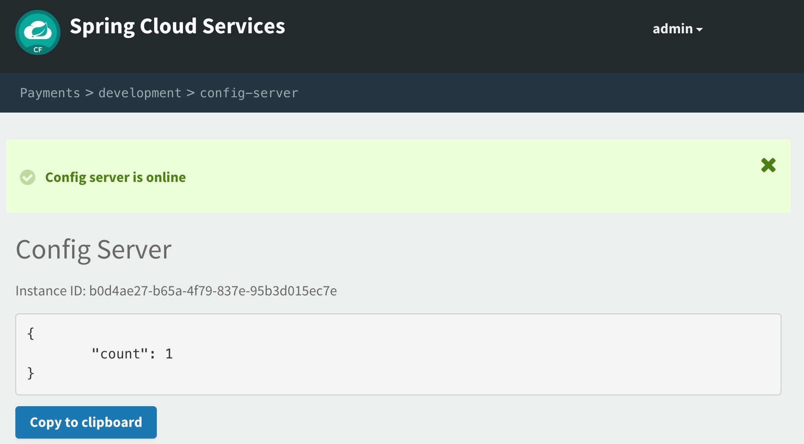

= Adding Spring Cloud Config to Boot Application

In this lab we'll utilize Spring Boot and Spring Cloud to configure our application from a configuration source dynamically retrieved from a git repository. We'll then deploy it to Pivotal Cloud Foundry and auto-provision an instance of a configuration server using Pivotal Spring Cloud Services.

== Update _Hello_ REST service

. These features are added by adding _spring-cloud-services-starter-config-client_ to the classpath.  Open your Maven POM found here: */cloud-native-spring/pom.xml*.  Add the following spring cloud services dependency:
+
[source, xml]
---------------------------------------------------------------------
<dependency>
    <groupId>io.pivotal.spring.cloud</groupId>
    <artifactId>spring-cloud-services-starter-config-client</artifactId>
</dependency>
---------------------------------------------------------------------

. We also need to add a general entry for Spring Cloud dependency management.  Add this snippet to your POM:
+
[source, xml]
---------------------------------------------------------------------
<dependencyManagement>
    <dependencies>
        <dependency>
            <groupId>org.springframework.cloud</groupId>
            <artifactId>spring-cloud-dependencies</artifactId>
            <version>Greenwich.RELEASE</version>
            <type>pom</type>
            <scope>import</scope>
        </dependency>
        <dependency>
            <groupId>io.pivotal.spring.cloud</groupId>
            <artifactId>spring-cloud-services-dependencies</artifactId>
            <version>2.0.2.RELEASE</version>
            <type>pom</type>
            <scope>import</scope>
        </dependency>
    </dependencies>
</dependencyManagement>
---------------------------------------------------------------------

. Add an @Value annotation, private field, and associated usage to the class _io.pivotal.cloudnativespring.CloudNativeSpringApplication_ (/cloud-native-spring/src/main/java/io/pivotal/cloudnativespring/CloudNativeSpringApplication.java):
+
[source, java, numbered]
---------------------------------------------------------------------
    @Value("${greeting:Hola}")
    private String _greeting;

    @RequestMapping("/hello")
    public String hello() {
        return _greeting + " World!";
    }
---------------------------------------------------------------------
+
Completed:
+
[source,java,numbered]
---------------------------------------------------------------------
package io.pivotal.cloudnativespring;

import org.springframework.beans.factory.annotation.Value;
import org.springframework.boot.SpringApplication;
import org.springframework.boot.autoconfigure.SpringBootApplication;
import org.springframework.boot.autoconfigure.domain.EntityScan;
import org.springframework.data.jpa.repository.config.EnableJpaRepositories;
import org.springframework.web.bind.annotation.RequestMapping;
import org.springframework.web.bind.annotation.RestController;

@SpringBootApplication
@EntityScan(basePackages = "io.pivotal.*")
@EnableJpaRepositories(basePackages = "io.pivotal.*")
@RestController
public class CloudNativeSpringApplication {

    public static void main(String[] args) {
        SpringApplication.run(CloudNativeSpringApplication.class, args);
    }

    @Value("${greeting:Hola}")
    private String _greeting;

    @RequestMapping("/hello")
    public String hello() {
        return _greeting + " World!";
    }

}
---------------------------------------------------------------------

. We'll also want to give our Spring Boot App a name so that it can lookup application-specific configuration from the config server later.  Add the following configuration to */cloud-native-spring/src/main/resources/application.properties*:
+
[source, properties]
---------------------------------------------------------------------
spring.application.name=cloud-native-spring
---------------------------------------------------------------------

. Complete Properties:
+
[source, properties]
---------------------------------------------------------------------
spring.h2.console.enabled=true
spring.h2.console.path=/h2-console
management.endpoints.web.exposure.include=*
management.info.git.mode=full
management.endpoint.health.show-details=always
spring.application.name=cloud-native-spring
# hard code username/password so you don't have to use the randomly generated one
spring.security.user.name=user
spring.security.user.password=password
---------------------------------------------------------------------

== Run the _cloud-native-spring_ Application and verify dynamic config is working

. Run the application
+
[source,bash]
---------------------------------------------------------------------
$ mvn clean spring-boot:run
---------------------------------------------------------------------

. Browse to http://localhost:8080 and verify you now see your new greeting.

. Stop the _cloud-native-spring_ application

== Create Spring Cloud Config Server instance

. Now that our application is ready to read its config from a cloud config server, we need to deploy one!  This can be done through cloudfoundry using the services marketplace.  Browse to the Marketplace in Pivotal Cloudfoundry Apps Manager, https://apps.sys.cnd-workshop.pcfdot.com/, navigate to the space you have been using to push your app, and select Config Server:
+

. In the resulting details page, select the _standard_, single tenant plan.  Name the instance *config-server*, select the space that you've been using to push all your applications.  At this time you don't need to select a application to bind to the service:
+

. After we create the service instance you'll be redirected to your _Space_ landing page that lists your apps and services.  The config server is deployed on-demand and will take a few moments to deploy.  Once the messsage _The Service Instance is Initializing_ disappears click on the service you provisioned.  Select the manage link towards the top of the resulting screen to view the instance id and a JSON document with a single element, count, which validates that the instance provisioned correctly:
+

. We now need to update the service instance with our GIT repository information.  Using the cloudfoundry CLI execute the following update service command:
+
[source,bash]
---------------------------------------------------------------------
$ cf update-service config-server -c '{"git": { "uri": "https://github.com/sharadg/config-server" } }'
---------------------------------------------------------------------

. Refresh you Config Server management page and you will see the following message.  Wait until the screen refreshes and the service is reintialized:
+

. We will now bind our application to our config-server within our Cloudfoundry deployment manifest.  Add these 2 entries to the bottom of */cloud-native-spring/manifest.yml*
+
[source, yml]
---------------------------------------------------------------------
env:
    TRUST_CERTS: api.cnd-workshop.pcfdot.com
services:
  - config-server
---------------------------------------------------------------------
+
Complete:
+
[source, yml]
---------------------------------------------------------------------
---
applications:
  - name: cloud-native-spring
    random-route: true
    memory: 1G
    instances: 1
    path: ./target/cloud-native-spring-0.0.1-SNAPSHOT-exec.jar
    timeout: 180 # to give time for the data to import
    env:
        TRUST_CERTS: api.cnd-workshop.pcfdot.com
    services:
      - config-server
---------------------------------------------------------------------

== Deploy and test application

. Build the application
+
[source,bash]
---------------------------------------------------------------------
$ mvn clean package
---------------------------------------------------------------------

. Push application into Cloud Foundry
+
[source,bash]
---------------------------------------------------------------------
$ cf push -f manifest.yml
---------------------------------------------------------------------

. Test your application by navigating to the root URL of the application, which will invoke the hello() service.  You should now see a greeting that is read from the cloud config server!
+
*Bon Jour World!*

. What just happened??  A Spring component within the Spring Cloud Starter Config Client module called a _service connector_ automatically detected that there was a Cloud Config service bound into the application.  The service connector configured the application automatically to connect to the cloud config server and download the configuration and wire it into the application

. If you navigate to the GIT repo we specified for our configuration, https://github.com/sharadg/config-server, you'll see a file named cloud-native-spring.yml.  This filename is the same as our _spring.application.name_ value for our Boot application.  The configuration is read from this file, in our case the following property:
+
[source, yaml]
---------------------------------------------------------------------
greeting: Bon Jour
---------------------------------------------------------------------

. Next we'll learn how to register our service with a service registry and load balance requests using Spring Cloud components.
