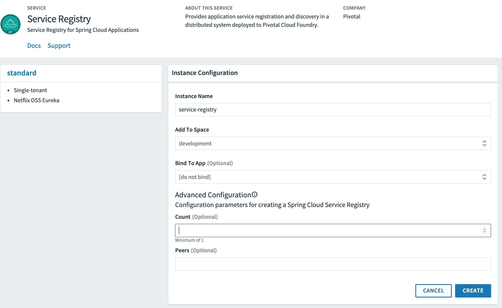
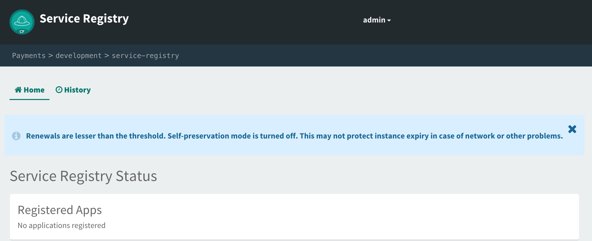
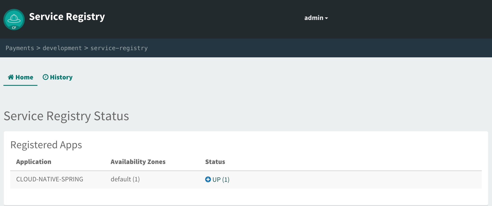
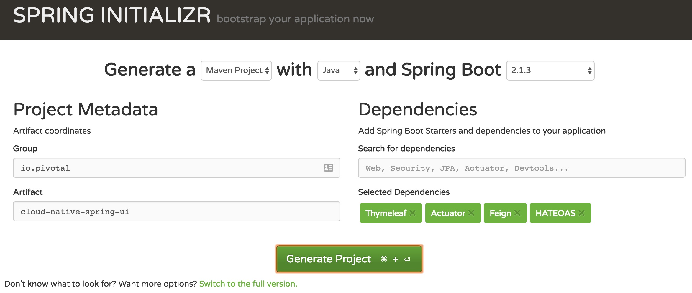

:compat-mode:
= Adding Service Registration and Discover with Spring Cloud

In this lab we'll utilize Spring Boot and Spring Cloud to configure our application to register itself with a service registry.  To do this we'll also need to provision an instance of a Eureka service registry using Pivotal Cloud Foundry Spring Cloud Services.  We'll also add a simple client application that looks up our application from the service registry and makes requests to our Cities service.

== Update _Cloud-Native-Spring_ Boot Application to Register with Eureka

. These features are added by adding _spring-cloud-services-starter-service-registry_ to the classpath. Open your Maven POM found here: */cloud-native-spring/pom.xml*. Add the following spring cloud services dependency:
+
[source, xml]
---------------------------------------------------------------------
<dependency>
    <groupId>io.pivotal.spring.cloud</groupId>
    <artifactId>spring-cloud-services-starter-service-registry</artifactId>
</dependency>
---------------------------------------------------------------------
+

. Thanks to Spring Cloud, instructing your application to register with Eureka is as simple as adding a single annotation to your app! Add an @EnableDiscoveryClient annotation to the class _io.pivotal.CloudNativeSpringApplication_ (*/cloud-native-spring/src/main/java/io/pivotal/CloudNativeApplication.java*):
+
[source, java, numbered]
---------------------------------------------------------------------
@SpringBootApplication
@EnableDiscoveryClient
public class CloudNativeSpringApplication {
---------------------------------------------------------------------
+
Completed:
+
[source,java,numbered]
---------------------------------------------------------------------
package io.pivotal.cloudnativespring;

import org.springframework.boot.SpringApplication;
import org.springframework.boot.autoconfigure.SpringBootApplication;
import org.springframework.cloud.client.discovery.EnableDiscoveryClient;

@SpringBootApplication
@EnableDiscoveryClient
public class CloudNativeSpringApplication {

    public static void main(String[] args) {
        SpringApplication.run(CloudNativeSpringApplication.class, args);
    }

}
---------------------------------------------------------------------

== Create Spring Cloud Service Registry instance and deploy application

. Now that our application is ready to read and register with a Eureka instance, we need to deploy a Eureka Registry!  This can be done through Pivotal Cloud Foundry using the Services Marketplace.  Previously we did this through the Marketplace UI, but this time we will use the Cloudfoundry CLI (though we could also do this through the UI:
+
[source,bash]
---------------------------------------------------------------------
$ cf create-service p-service-registry standard service-registry
---------------------------------------------------------------------
+
Or you can use Services Marketplace to create an instance of Service Registry:
+

. After you create the service registry instance, navigate to your cloudfoundry space in the Apps Manager UI and refresh the page.  You should now see the newly create service registry intance.  Select the manage link to view the registry dashboard.  Note that there are not any registered applications at the moment:
+

. We will now bind our application to our service-registry within our Cloudfoundry deployment manifest.  Add the additional reference to the service to the bottom of */cloud-native-spring/manifest.yml* in the services list:
+
[source, yml]
---------------------------------------------------------------------
  services:
  - config-server
  - service-registry
---------------------------------------------------------------------
+
Complete:
+
[source, yml]
---------------------------------------------------------------------
---
applications:
  - name: cloud-native-spring
    random-route: true
    memory: 1G
    instances: 1
    timeout: 180 # to give time for the data to import
    path: ./target/cloud-native-spring-0.0.1-SNAPSHOT-exec.jar
    buildpack: java_buildpack_offline
    env:
      TRUST_CERTS: api.cnd-workshop.pcfdot.com
    services:
      - config-server
      - service-registry
---------------------------------------------------------------------

== Deploy and test application

. Build the application
+
[source,bash]
---------------------------------------------------------------------
$ mvn clean package
---------------------------------------------------------------------

. For the 2nd half of this lab we’ll need to have this maven artifact in our local repository, so install it with the following command:
+
[source,bash]
---------------------------------------------------------------------
$ mvn install
---------------------------------------------------------------------

. Push application into Cloud Foundry
+
[source,bash]
---------------------------------------------------------------------
$ cf push
---------------------------------------------------------------------

. If we now test our application URLs we will see no change.  However, if we view the Service Registry dashboard (accessible from the _manage_ link in Apps Manager) you will see that a service named cloud-native-spring has been registered:
+

. Next we'll create a simple UI application that will read the service registry to discover the location of our cities REST service and connect.

== Create another Spring Boot Project as a Client UI

. Browse to https://start.spring.io

. Generate a Maven Project with Spring Boot 2.1.3.

. Fill out the *Project metadata* fields as follows:
+
Group:: +io.pivotal+
Artifact:: +cloud-native-spring-ui+

. In the dependencies section, add the following:
+
*Thymeleaf*, *Actuator*, *Feign*, *HATEOS*

. Click the _Generate Project_ button. Your browser will download a zip file.
+

. Copy then unpack the downloaded zip file to *Cloud-Native-Java-Workshop/labs/lab05/cloud-native-spring-ui*
+
Your directory structure should now look like:
+
[source, bash]
---------------------------------------------------------------------
Cloud-Native-Java-Workshop:
├── labs
│   ├── lab01
│   │   ├── cloud-native-spring
│   ├── lab05
│   │   ├── cloud-native-spring-ui
---------------------------------------------------------------------

. Import the project’s pom.xml into your editor/IDE of choice.

. We will need to add a the general entry for Spring Cloud Services dependency management as we added to our other project.  Open your Maven POM found here: */cloud-native-spring-ui/pom.xml*:
+
[source, xml]
---------------------------------------------------------------------
<dependency>
    <groupId>io.pivotal.spring.cloud</groupId>
    <artifactId>spring-cloud-services-dependencies</artifactId>
    <version>2.0.2.RELEASE</version>
    <type>pom</type>
    <scope>import</scope>
</dependency>
---------------------------------------------------------------------
+
Completed POM import dependencies section:
+
[source, xml]
---------------------------------------------------------------------
<dependencyManagement>
    <dependencies>
        <dependency>
            <groupId>org.springframework.cloud</groupId>
            <artifactId>spring-cloud-dependencies</artifactId>
            <version>${spring-cloud.version}</version>
            <type>pom</type>
            <scope>import</scope>
        </dependency>
        <dependency>
            <groupId>io.pivotal.spring.cloud</groupId>
            <artifactId>spring-cloud-services-dependencies</artifactId>
            <version>2.0.2.RELEASE</version>
            <type>pom</type>
            <scope>import</scope>
        </dependency>
    </dependencies>
</dependencyManagement>
---------------------------------------------------------------------

. As before, we need to add _spring-cloud-services-starter-service-registry_ and reference to _io.pivotal.cloudnativespring.domain.City_ Entity class to the classpath.  Add these to your POM:
+
[source, xml]
---------------------------------------------------------------------
<dependency>
    <groupId>io.pivotal.spring.cloud</groupId>
    <artifactId>spring-cloud-services-starter-service-registry</artifactId>
</dependency>
<dependency>
    <groupId>io.pivotal</groupId>
    <artifactId>cloud-native-spring</artifactId>
    <version>0.0.1-SNAPSHOT</version>
</dependency>
---------------------------------------------------------------------
+
Completed dependencies:
+
[source, xml]
---------------------------------------------------------------------
<dependencies>
    <dependency>
        <groupId>org.springframework.boot</groupId>
        <artifactId>spring-boot-starter-actuator</artifactId>
    </dependency>
    <dependency>
        <groupId>org.springframework.boot</groupId>
        <artifactId>spring-boot-starter-thymeleaf</artifactId>
    </dependency>
    <dependency>
        <groupId>org.springframework.cloud</groupId>
        <artifactId>spring-cloud-starter-openfeign</artifactId>
    </dependency>
    <dependency>
        <groupId>io.pivotal.spring.cloud</groupId>
        <artifactId>spring-cloud-services-starter-service-registry</artifactId>
    </dependency>
    <dependency>
        <groupId>org.springframework.boot</groupId>
        <artifactId>spring-boot-starter-hateoas</artifactId>
    </dependency>
    <dependency>
        <groupId>io.pivotal</groupId>
        <artifactId>cloud-native-spring</artifactId>
        <version>0.0.1-SNAPSHOT</version>
    </dependency>
    <dependency>
        <groupId>org.springframework.boot</groupId>
        <artifactId>spring-boot-starter-test</artifactId>
        <scope>test</scope>
    </dependency>
</dependencies>
---------------------------------------------------------------------

. Since this UI is going to consume REST services, it's an awesome opportunity to use Feign.  Feign will handle *ALL* the work of invoking our services and marshalling/unmarshalling JSON into domain objects.  We'll add a Feign Client interface into our app.  Take note of how Feign references the downstream service; it's only the name of the service it will lookup from Eureka service registry.  Add the following interface declaration to the _CloudNativeSpringUIApplication_:
+
[source,java,numbered]
---------------------------------------------------------------------
@FeignClient(value = "cloud-native-spring")
interface CityClient {
    @RequestMapping(method = RequestMethod.GET, value = "/cities", produces = "application/hal+json")
    PagedResources<City> getCities();
}
---------------------------------------------------------------------
+
We'll also need to add a few annotations to our boot application:
+
[source,java,numbered]
---------------------------------------------------------------------
@SpringBootApplication
@EnableFeignClients
@EnableDiscoveryClient
public class CloudNativeSpringUiApplication {
---------------------------------------------------------------------
+
Completed:
+
[source,java,numbered]
---------------------------------------------------------------------
package io.pivotal.cloudnativespringui;

import io.pivotal.cloudnativespring.domain.City;
import org.springframework.boot.SpringApplication;
import org.springframework.boot.autoconfigure.SpringBootApplication;
import org.springframework.boot.autoconfigure.data.rest.RepositoryRestMvcAutoConfiguration;
import org.springframework.cloud.client.discovery.EnableDiscoveryClient;
import org.springframework.cloud.openfeign.EnableFeignClients;
import org.springframework.cloud.openfeign.FeignClient;
import org.springframework.hateoas.PagedResources;
import org.springframework.web.bind.annotation.RequestMapping;
import org.springframework.web.bind.annotation.RequestMethod;

@SpringBootApplication
@EnableFeignClients
@EnableDiscoveryClient
public class CloudNativeSpringUiApplication {

    public static void main(String[] args) {
        SpringApplication.run(CloudNativeSpringUiApplication.class, args);
    }

    @FeignClient(value = "cloud-native-spring")
    interface CityClient {
        @RequestMapping(method = RequestMethod.GET, value = "/cities", produces = "application/hal+json")
        PagedResources<City> getCities();
    }
}
---------------------------------------------------------------------

. Next we'll create a simple _@Controller_ for serving up the thymeleaf page.  Create the class _io.pivotal.cloudnativespringui.CitiesController_ (/cloud-native-spring-ui/src/main/java/io/pivotal/cloudnativespringui/CitiesController.java) and into it paste the following code:
+
[source,java]
---------------------------------------------------------------------
package io.pivotal.cloudnativespringui;

import org.springframework.stereotype.Controller;
import org.springframework.ui.Model;
import org.springframework.web.bind.annotation.GetMapping;

@Controller
public class CitiesController {

    private CloudNativeSpringUiApplication.CityClient feignCitiesClient;

    public CitiesController(CloudNativeSpringUiApplication.CityClient feignCitiesClient) {
        this.feignCitiesClient = feignCitiesClient;
    }

    @GetMapping("/")
    public String getCities(Model model) {

        model.addAttribute("cities", feignCitiesClient.getCities());
        return "cities"; //thymeleaf template
    }
}
---------------------------------------------------------------------

. Next we'll create a Thymeleaf template for rendering our data.  Our template will consume the content returned by Feign client we just created.  Create template _cities.html_ under */cloud-native-spring-ui/src/main/resources/templates*
+
Your directory structure should now look like:
+
[source, bash]
---------------------------------------------------------------------
cloud-native-spring-ui:
├── src
│   ├── main
│   │   ├── resources
│   │   │   ├── templates
│   │   │   │   ├── cities.html
---------------------------------------------------------------------
+
And paste the following code into it:
+
[source,html]
---------------------------------------------------------------------
<!doctype html>
<html lang="en" xmlns="http://www.w3.org/1999/xhtml"
      xmlns:th="http://www.thymeleaf.org">

<head>
    <!-- Required meta tags -->
    <meta charset="utf-8">
    <meta name="viewport" content="width=device-width, initial-scale=1, shrink-to-fit=no">

    <!-- Bootstrap CSS -->
    <link rel="stylesheet" href="https://stackpath.bootstrapcdn.com/bootstrap/4.3.1/css/bootstrap.min.css"
          integrity="sha384-ggOyR0iXCbMQv3Xipma34MD+dH/1fQ784/j6cY/iJTQUOhcWr7x9JvoRxT2MZw1T" crossorigin="anonymous">

    <title>Spring Boot Discovery Client Example - Cities</title>
</head>
<body>
<h1>Spring Boot Discovery Client Example - Cities</h1>

    <table id="cityTable" class="table table-dark">
        <thead>
        <tr>
            <th scope="col">Name</th>
            <th scope="col">County</th>
            <th scope="col">State</th>
            <th scope="col">PostalCode</th>
            <th scope="col">Latitude</th>
            <th scope="col">Longitude</th>
        </tr>
        </thead>
        <tr th:each="city : ${cities}">
            <th scope="row" th:text="${city.name}"></th>
            <td th:text="${city.county}"></td>
            <td th:text="${city.stateCode}"></td>
            <td th:text="${city.postalCode}"></td>
            <td th:text="${city.latitude}"></td>
            <td th:text="${city.longitude}"></td>
        </tr>
    </table>

<!-- Optional JavaScript -->
<!-- jQuery first, then Popper.js, then Bootstrap JS -->

</body>
</html>
---------------------------------------------------------------------

. We'll also want to give our UI App a name so that it can register properly with Eureka and potentially use cloud config in the future.  Add the following configuration to */cloud-native-spring-ui/src/main/resources/application.properties*:
+
[source, properties]
---------------------------------------------------------------------
spring.jpa.generate-ddl=false
spring.jpa.hibernate.ddl-auto=none
spring.application.name=cloud-native-spring-ui
spring.data.rest.base-path=/api
---------------------------------------------------------------------

== Deploy and test application

. Build the application.  We have to skip the tests otherwise we may fail because of having 2 spring boot apps on the classpath
+
[source,bash]
---------------------------------------------------------------------
$ mvn clean package -DskipTests
---------------------------------------------------------------------

. Create an application manifest in the root folder /cloud-native-spring-ui
+
$ touch manifest.yml

. Add application metadata
+
[source, yaml]
---------------------------------------------------------------------
---
applications:
    - name: cloud-native-spring-ui
      random-route: true
      memory: 1G
      instances: 1
      path: ./target/cloud-native-spring-ui-0.0.1-SNAPSHOT.jar
      buildpack: java_buildpack_offline
      env:
        TRUST_CERTS: api.cnd-workshop.pcfdot.com
      services:
        - service-registry
---------------------------------------------------------------------

. Push application into Cloud Foundry
+
[source,bash]
---------------------------------------------------------------------
$ cf push
---------------------------------------------------------------------

. Test your application by navigating to the URL of the application, which should show the Thymeleaf template with list of cities.

. From a commandline stop the cloud-native-spring microservice (the original city service, not the new UI)
+
[source,bash]
---------------------------------------------------------------------
$ cf stop cloud-native-spring
---------------------------------------------------------------------
. Refresh the UI app.  What happens?  Now you get a nasty error that is not very user friendly!

. Next we'll learn how to make our UI Application more resilient in the case that our downstream services are unavailable.
